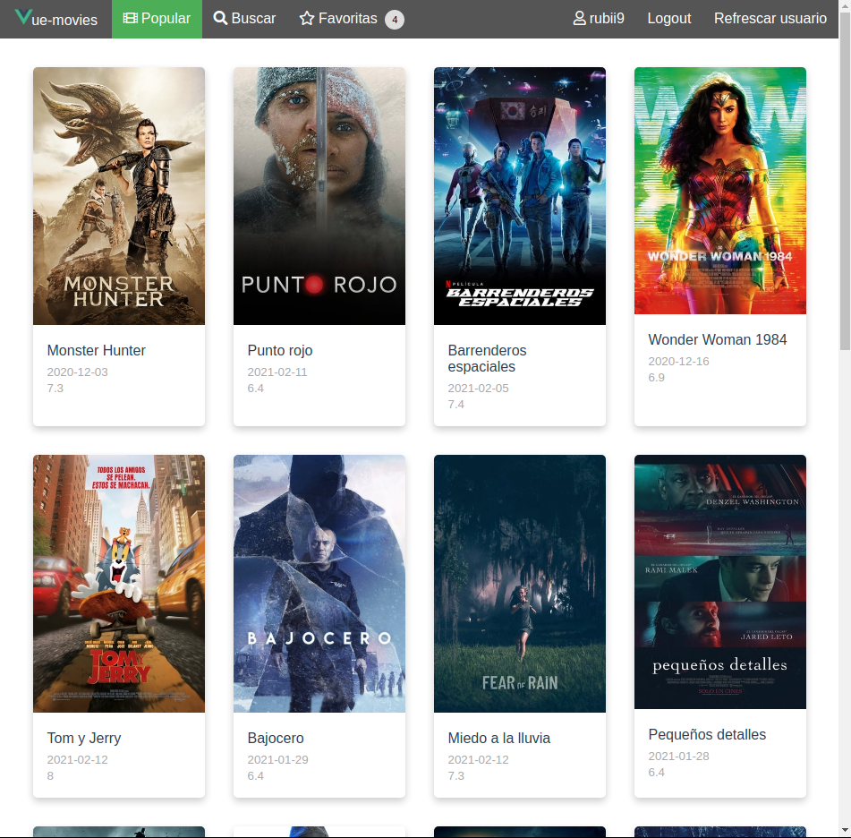

# vue-movies-course

Proyecto realizado en VueJs, con api externa [TheMoviedb](https://www.themoviedb.org/?language=es-ES) que permite buscar películas, ver la descripción y los avtores, y además con un login nos permite añadir a favoritas.

## APP



## Project setup

```
npm install
```

### Setup moviedb

add on .env the api key

### Compiles and hot-reloads for development

```
npm run serve
```

### Compiles and minifies for production

```
npm run build
```

### Lints and fixes files

```
npm run lint
```

### Customize configuration

See [Configuration Reference](https://cli.vuejs.org/config/).
